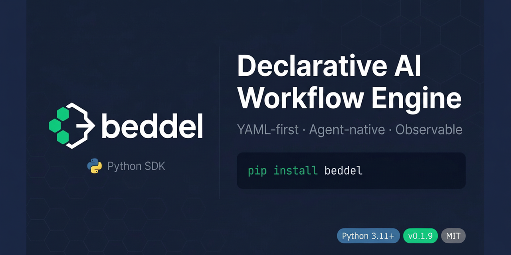

<p align="center">
  
</p>

[](https://pypi.org/project/beddel/)
[](https://www.python.org/downloads/)
[](https://opensource.org/licenses/MIT)
[](https://github.com/astral-sh/ruff)
[](https://docs.pydantic.dev/)
[]()

Declarative YAML-based AI workflow engine for Python.

```yaml
steps:
  - id: greet
    primitive: llm
    config:
      model: gemini/gemini-2.0-flash
      prompt: "Say hello and share a fun fact about $input.topic"
      temperature: 0.7
```

```python
import beddel
beddel.setup()

from beddel.domain.parser import WorkflowParser
from beddel.domain.executor import WorkflowExecutor
from beddel.domain.registry import PrimitiveRegistry
from beddel.primitives import register_builtins
from beddel_provider_litellm.adapter import LiteLLMAdapter

workflow = WorkflowParser.parse(open("workflow.yaml").read())
registry = PrimitiveRegistry()
register_builtins(registry)

result = await WorkflowExecutor(registry, provider=LiteLLMAdapter()).execute(
    workflow, inputs={"topic": "astronomy"}
)
```

## Without Beddel vs With Beddel

<table>
<tr><th>Without (pure Python)</th><th>With Beddel (YAML + 3 lines)</th></tr>
<tr>
<td>

```python
import asyncio
from litellm import acompletion

async def pipeline(topic):
    # Step 1: research
    r1 = await acompletion(
        model="gemini/gemini-2.0-flash",
        messages=[{"role": "user",
            "content": f"Research {topic}"}],
    )
    # Step 2: summarize (retry logic)
    for attempt in range(3):
        try:
            r2 = await acompletion(
                model="gemini/gemini-2.0-flash",
                messages=[{"role": "user",
                    "content": f"Summarize: "
                    f"{r1.choices[0].message.content}"}],
            )
            break
        except Exception:
            if attempt == 2: raise
            await asyncio.sleep(2 ** attempt)
    return r2.choices[0].message.content
```

</td>
<td>

```yaml
steps:
  - id: research
    primitive: llm
    config:
      model: gemini/gemini-2.0-flash
      prompt: "Research $input.topic"

  - id: summarize
    primitive: llm
    config:
      model: gemini/gemini-2.0-flash
      prompt: "Summarize: $stepResult.research.content"
    execution_strategy:
      type: retry
      retry:
        max_attempts: 3
        backoff_base: 2.0
```

</td>
</tr>
</table>

The YAML version gets you retry with backoff, tracing, lifecycle hooks, and streaming — for free.


## Install

```bash
pip install beddel                          # core (3 deps: pydantic, pyyaml, click)
beddel kit install provider-litellm-kit     # LLM provider adapter
```

Or install with batteries included:

```bash
pip install "beddel[default]"   # core + litellm + opentelemetry + fastapi + httpx
```

Requires Python 3.11+.

> **Python API users:** Call `beddel.setup()` before importing kit modules. This activates kit paths. CLI commands (`beddel run`, `beddel serve`) handle this automatically.

## Why Beddel

- Write workflows in YAML, not hundreds of lines of Python
- 7 compositional primitives cover most AI workflow patterns
- 100+ LLM providers via [LiteLLM](https://docs.litellm.ai/) — OpenAI, Gemini, Anthropic, Bedrock, Ollama, and more
- Adaptive execution: branching, retry, reflection loops, parallel, circuit breaker, goal-oriented, durable (SQLite exactly-once)
- Solution Kit ecosystem — slim core (3 pip deps), isolated kits for adapters, tools, and integrations
- OpenTelemetry + Langfuse tracing with per-step token tracking
- Enterprise safety: HOTL approval gates, PII tokenization, state persistence, episodic memory
- Multi-agent coordination, event-driven execution, skill composition
- MCP client (stdio + SSE) for tool discovery and invocation
- Hexagonal architecture — swap adapters without touching domain logic

## Quickstart

### 1. Set your API key

Get a free key from [Google AI Studio](https://aistudio.google.com/apikey):

```bash
export GEMINI_API_KEY="your-key-here"
```

### 2. Create `workflow.yaml`

```yaml
id: hello-world
name: Hello World

input_schema:
  type: object
  properties:
    topic: { type: string }
  required: [topic]

steps:
  - id: greet
    primitive: llm
    config:
      model: gemini/gemini-2.0-flash
      prompt: "Say hello and share one fun fact about $input.topic"
      temperature: 0.7
```

### 3. Run it

**CLI:**

```bash
beddel run workflow.yaml -i topic=astronomy
```

**Python:**

```python
import asyncio
import beddel
from pathlib import Path

beddel.setup()

from beddel.domain.executor import WorkflowExecutor
from beddel.domain.parser import WorkflowParser
from beddel.domain.registry import PrimitiveRegistry
from beddel.primitives import register_builtins
from beddel_provider_litellm.adapter import LiteLLMAdapter

async def main():
    workflow = WorkflowParser.parse(Path("workflow.yaml").read_text())
    registry = PrimitiveRegistry()
    register_builtins(registry)
    result = await WorkflowExecutor(registry, provider=LiteLLMAdapter()).execute(
        workflow, inputs={"topic": "astronomy"}
    )
    print(result["step_results"]["greet"]["content"])

asyncio.run(main())
```

> Model names use [LiteLLM format](https://docs.litellm.ai/) (`provider/model`).

## Primitives

Seven built-in primitives that compose into complex agent behaviors:

| Primitive | Description |
|-----------|-------------|
| `llm` | Single-turn LLM invocation with streaming |
| `chat` | Multi-turn conversation with context windowing |
| `output-generator` | Template-based rendering (JSON, Markdown, text) |
| `guardrail` | Input/output validation with 4 failure strategies (raise, return_errors, correct, delegate) |
| `call-agent` | Nested workflow invocation with depth tracking |
| `tool` | External function invocation (sync and async) |
| `agent-exec` | Unified agent adapter delegation (OpenClaw, Claude, Codex, Kiro CLI) |

## Variable System

Three built-in namespaces plus custom registration:

```yaml
prompt: "Tell me about $input.topic"           # runtime inputs
prompt: "Expand on $stepResult.step1.content"   # previous step outputs
prompt: "Using key $env.API_KEY"                # environment variables
```

```python
# Plug in domain knowledge, memory, or any data source
resolver.register_namespace("knowledge", my_domain_handler)
resolver.register_namespace("memory", my_memory_handler)
```

## Execution Strategies

Five strategies per step, with exponential backoff and jitter for retries:

| Strategy | Behavior |
|----------|----------|
| `fail` | Stop workflow on error (default) |
| `skip` | Log error, continue to next step |
| `retry` | Retry with exponential backoff and jitter |
| `fallback` | Execute an alternative step on failure |
| `delegate` | Delegate error recovery to agent judgment |

Plus advanced patterns: reflection loops, parallel fan-out/fan-in, circuit breaker, goal-oriented loops, and durable execution with SQLite exactly-once semantics.

## Solution Kits

Adapters, tools, and integrations are distributed as isolated solution kits:

```bash
beddel kit install provider-litellm-kit     # from official repository
beddel kit install ./my-custom-kit/         # from local directory
beddel kit list                             # list installed kits
```

| Category | Kit | Dependencies |
|----------|-----|-------------|
| provider | `provider-litellm-kit` | litellm |
| agent | `agent-openclaw-kit` | httpx |
| agent | `agent-claude-kit` | claude-agent-sdk |
| agent | `agent-codex-kit` | — |
| agent | `agent-kiro-kit` | — |
| observability | `observability-otel-kit` | opentelemetry-api |
| observability | `observability-langfuse-kit` | langfuse |
| serve | `serve-fastapi-kit` | fastapi, sse-starlette |
| protocol | `protocol-mcp-kit` | mcp, jsonschema |
| auth | `auth-github-kit` | httpx |
| tools | `tools-file-kit`, `tools-shell-kit`, `tools-gates-kit`, `tools-http-kit` | httpx (http only) |

Each kit declares its own pip dependencies in `kit.yaml`. The `install` command handles them automatically.


## Observability

**OpenTelemetry** — Opt-in tracing with workflow, step, and primitive-level spans. Token usage tracking per step. Zero overhead when disabled.

```python
import beddel
beddel.setup()

from beddel_observability_otel.adapter import OpenTelemetryAdapter

tracer = OpenTelemetryAdapter(service_name="my-app")
executor = WorkflowExecutor(registry, provider=adapter, tracer=tracer)
```

**Langfuse** — Drop-in adapter for [Langfuse](https://langfuse.com/) with token usage, latency, and cost attribution.

**Lifecycle Hooks** — 10 event callbacks for custom logging, metrics, or side effects. Hook failures are silently caught — a misbehaving hook never breaks workflow execution.

## Serve Workflows as HTTP/SSE

```bash
beddel kit install serve-fastapi-kit
beddel serve -w workflow.yaml --port 8000
```

Or programmatically:

```python
from fastapi import FastAPI
from beddel.integrations.fastapi import create_beddel_handler

app = FastAPI()
app.include_router(create_beddel_handler(workflow))
```

Endpoints: `POST /workflows/{id}` (SSE response), `GET /health`.

## Enterprise Features

- **HOTL Approval Gates** — Risk-based auto-approve for low-risk, async approval for high-risk, timeout escalation
- **PII Tokenization** — Regex-based tokenize/detokenize pipeline, extensible patterns per deployment
- **State Persistence** — Pluggable stores (in-memory, JSON file), checkpoint/resume support
- **Episodic Memory** — Composite dual-backend routing (short-term + long-term), `$memory.*` namespace
- **Knowledge Architecture** — `IKnowledgeProvider` port with YAML adapter, `$knowledge.*` namespace, backend-agnostic
- **Budget Enforcement** — Per-workflow cost limits with automatic model tier degradation
- **Model Tier Selection** — Declare intent (`fast`, `balanced`, `powerful`) instead of hardcoding model names
- **Multi-Agent Coordination** — Supervisor, handoff, and parallel strategies
- **Event-Driven Execution** — Webhooks, cron schedules, SSE stream triggers
- **Skill Composition** — Kit-based skill resolution with version constraints and governance

## CLI

```bash
beddel validate workflow.yaml                    # validate YAML schema
beddel run workflow.yaml -i topic=astronomy      # execute workflow
beddel run workflow.yaml -i topic=ai --json-output  # machine-readable output
beddel list-primitives                           # list registered primitives
beddel serve -w workflow.yaml --port 8000        # start HTTP/SSE server
beddel kit install provider-litellm-kit          # install a kit
beddel kit list                                  # list installed kits
beddel kit export workflow.yaml --format json    # export workflow
beddel connect                                   # authenticate with Beddel Cloud
beddel status                                    # show connection status
beddel version                                   # print version
```

## Examples

The [`examples/`](./examples/) directory contains ready-to-run workflows:

| Example | What it demonstrates |
|---------|---------------------|
| [`research-pipeline.yaml`](./examples/research-pipeline.yaml) | Sequential multi-step, `$stepResult` cross-references, retry |
| [`email-classifier.yaml`](./examples/email-classifier.yaml) | `if/then/else` branching, retry + skip strategies |
| [`chat-with-guardrail.yaml`](./examples/chat-with-guardrail.yaml) | Multi-turn conversation, output validation |

```bash
beddel run examples/research-pipeline.yaml -i topic="AI agents" -i depth="brief"
```

## Architecture

Hexagonal Architecture (Ports & Adapters) with a Solution Kit ecosystem. The domain core never imports from adapters — all external dependencies flow through port interfaces.

```
┌─────────────────────────────────────────────┐
│           Ecosystem Patterns                 │
│  Decisions · Coordination · Events · Skills  │
├─────────────────────────────────────────────┤
│           Enterprise Safety                  │
│  HOTL · PII · State · Memory · Knowledge     │
├─────────────────────────────────────────────┤
│            Solution Kits (kits/)             │
│  provider-litellm · agent-openclaw/claude/   │
│  codex/kiro · observability-otel/langfuse    │
│  serve-fastapi · protocol-mcp · auth-github  │
│  tools-file/shell/gates/http                 │
├─────────────────────────────────────────────┤
│            Compositional Primitives          │
│  llm · chat · output · guardrail · tool      │
│  call-agent · agent-exec                     │
├─────────────────────────────────────────────┤
│          Adaptive Execution Engine           │
│  Sequential · Reflection · Parallel          │
│  Circuit Breaker · Goal-Oriented · Durable   │
├─────────────────────────────────────────────┤
│              Domain Core                     │
│  Parser · Resolver · Executor · Registry     │
│  Models · Ports · Kit Discovery              │
└─────────────────────────────────────────────┘
```

## Development

```bash
git clone https://github.com/botanarede/beddel-py.git
cd beddel-py
pip install -e ".[dev]"

pytest                  # 2072 tests
ruff check . && ruff format .
mypy src/
```

## Links

- [Documentation](https://beddel.com.br/docs)
- [Repository](https://github.com/botanarede/beddel-py)
- [Bug Tracker](https://github.com/botanarede/beddel-py/issues)

[](https://beddelprotocol.substack.com/subscribe)

## Contributing

Contributions welcome. Open an issue to discuss before submitting a PR.

## License

MIT
