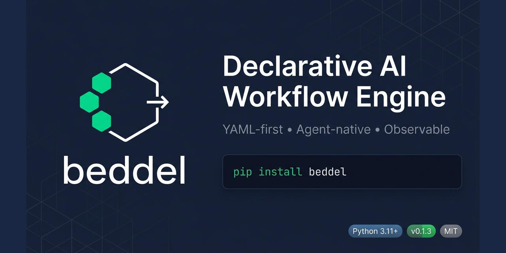

<p align="center">
  
</p>

# Beddel

[](https://pypi.org/project/beddel/)
[](https://www.python.org/downloads/)
[](https://opensource.org/licenses/MIT)
[](https://github.com/astral-sh/ruff)
[](https://mypy.readthedocs.io/)
[](https://docs.pydantic.dev/)
[](https://github.com/pypa/hatch)
[]()
[](https://pypi.org/project/beddel/)

Declarative YAML-based AI workflow engine for Python. Knowledge-architecture-aware.

Define outcome-driven AI workflows in YAML — the engine handles adaptive execution with conditional branching, retry strategies, multi-provider LLM abstraction, and compositional primitives. Bring your domain knowledge in any format; Beddel workflows reason over it. YAML for the backbone, code escape hatches for complex logic.

```yaml
steps:
  - id: greet
    primitive: llm
    config:
      model: gemini/gemini-2.0-flash
      prompt: "Say hello and share a fun fact about $input.topic"
      temperature: 0.7
```

## Why Beddel

- Write workflows in YAML, not hundreds of lines of Python
- 7 compositional primitives cover most AI workflow patterns out of the box
- Multi-provider LLM support via [LiteLLM](https://docs.litellm.ai/) (100+ providers)
- Adaptive execution: branching, retry with backoff, reflection loops, parallel, circuit breaker, goal-oriented, durable (SQLite exactly-once)
- Solution Kit ecosystem — slim core, isolated kits for adapters, tools, and integrations
- 4 agent adapters: OpenClaw, Claude, Codex, Kiro CLI
- OpenTelemetry + Langfuse tracing with token usage tracking per step
- Model tier selection, effort control, and budget enforcement
- Enterprise safety: HOTL approval gates, PII tokenization, state persistence
- Episodic memory and knowledge architecture ports
- Multi-agent coordination, event-driven execution, skill composition
- Lifecycle hooks for custom logging, metrics, and side effects
- Expose workflows as HTTP/SSE endpoints with one function call
- MCP client (stdio + SSE) for tool discovery and invocation
- Hexagonal architecture — swap adapters without touching domain logic
- Extensible namespace system — plug in domain knowledge, memory, or any data source via `register_namespace()`

## Installation

```bash
pip install beddel
```

This installs the core engine with 3 dependencies (`pydantic`, `pyyaml`, `click`): parser, resolver, executor, registry, kit discovery, and CLI. Requires Python 3.11+.

### Installing Kits

Adapters, tools, and integrations are distributed as solution kits in the [beddel repository](https://github.com/botanarede/beddel). Install them with the CLI:

```bash
# Install a kit from the official repository (downloads + installs pip deps)
beddel kit install provider-litellm-kit

# Install from an explicit GitHub path
beddel kit install github:botanarede/beddel/kits/agent-openclaw-kit

# Install from a local directory
beddel kit install ./my-custom-kit/

# Install globally (shared across projects)
beddel kit install provider-litellm-kit --global

# List installed kits
beddel kit list
```

Each kit declares its own pip dependencies in `kit.yaml`. The `install` command handles them automatically:

```
$ beddel kit install provider-litellm-kit
Installing litellm>=1.40,<1.82.7 ...
Installed provider-litellm-kit v0.1.0 to ./kits/provider-litellm-kit
```

### Available Kits

| Category | Kit | Pip Dependencies |
|----------|-----|-----------------|
| agent | `agent-openclaw-kit` | httpx |
| agent | `agent-claude-kit` | claude-agent-sdk |
| agent | `agent-codex-kit` | — |
| agent | `agent-kiro-kit` | — |
| provider | `provider-litellm-kit` | litellm |
| observability | `observability-otel-kit` | opentelemetry-api |
| observability | `observability-langfuse-kit` | langfuse |
| serve | `serve-fastapi-kit` | fastapi, sse-starlette |
| protocol | `protocol-mcp-kit` | mcp, jsonschema |
| auth | `auth-github-kit` | httpx |
| tools | `tools-file-kit` | — |
| tools | `tools-shell-kit` | — |
| tools | `tools-gates-kit` | — |
| tools | `tools-http-kit` | httpx |

## Quickstart

Get a workflow running in under 5 minutes.

### 1. Install

```bash
pip install beddel
beddel kit install provider-litellm-kit
```

### 2. Set your API key

Get a free key from [Google AI Studio](https://aistudio.google.com/apikey):

```bash
export GEMINI_API_KEY="your-key-here"
```

### 3. Create a workflow

Save as `workflow.yaml`:

```yaml
id: hello-world
name: Hello World
description: A minimal workflow that greets the user with a fun fact.

input_schema:
  type: object
  properties:
    topic:
      type: string
  required:
    - topic

steps:
  - id: greet
    primitive: llm
    config:
      model: gemini/gemini-2.0-flash
      prompt: "Say hello and share one fun fact about $input.topic"
      temperature: 0.7
```

### 4. Run it

```python
import asyncio
from pathlib import Path

from beddel_provider_litellm.adapter import LiteLLMAdapter
from beddel.domain.executor import WorkflowExecutor
from beddel.domain.parser import WorkflowParser
from beddel.domain.registry import PrimitiveRegistry
from beddel.primitives import register_builtins

async def main():
    workflow = WorkflowParser.parse(Path("workflow.yaml").read_text())

    registry = PrimitiveRegistry()
    register_builtins(registry)

    executor = WorkflowExecutor(registry, provider=LiteLLMAdapter())
    # Preferred: use deps= for full dependency injection
    # executor = WorkflowExecutor(registry, deps=DefaultDependencies(llm_provider=LiteLLMAdapter()))
    result = await executor.execute(workflow, inputs={"topic": "astronomy"})

    print(result["step_results"]["greet"]["content"])

asyncio.run(main())
```

```bash
python run_workflow.py
```

> Model names use the [LiteLLM format](https://docs.litellm.ai/) (`provider/model`). Avoid experimental (`-exp`) suffixes — they get retired without notice.


## Examples

The [`examples/`](./examples/) directory contains ready-to-run workflows:

| Example | Primitives | What it demonstrates |
|---------|-----------|---------------------|
| [`research-pipeline.yaml`](./examples/research-pipeline.yaml) | llm, output-generator | Sequential multi-step, `$stepResult` cross-references, retry |
| [`email-classifier.yaml`](./examples/email-classifier.yaml) | llm, output-generator | `if/then/else` branching, retry + skip strategies |
| [`chat-with-guardrail.yaml`](./examples/chat-with-guardrail.yaml) | chat, guardrail, output-generator | Multi-turn conversation, output validation |

Run any example with the CLI:

```bash
pip install beddel
beddel kit install provider-litellm-kit
export GEMINI_API_KEY="your-key-here"

# Research pipeline
beddel run examples/research-pipeline.yaml -i topic="AI agents" -i depth="brief"

# Email classifier with branching
beddel run examples/email-classifier.yaml -i email_body="How do I configure nginx SSL?"

# Chat with guardrail validation
beddel run examples/chat-with-guardrail.yaml \
  -i question="What are the benefits of microservices?" \
  -i context="enterprise software architecture"
```


## Features

### Adaptive Core Engine (Epic 1)

The foundation. Parses YAML workflows, resolves variables, and executes steps with adaptive control flow.

**YAML Parser** — Secure loading via `yaml.safe_load()` with Pydantic 2.x validation. Supports workflow metadata, step definitions, variable references, conditional expressions, and execution strategy declarations.

**Variable Resolver** — Extensible namespace system with three built-in namespaces and a registration mechanism for custom ones:

```yaml
prompt: "Tell me about $input.topic"           # Runtime inputs
prompt: "Expand on $stepResult.step1.content"   # Previous step outputs
prompt: "Using key $env.API_KEY"                # Environment variables
```

```python
# Register custom namespaces — domain knowledge, memory, or any data source
resolver.register_namespace("memory", my_memory_handler)
resolver.register_namespace("knowledge", my_domain_handler)
```

The namespace system is the integration point for domain knowledge. The handler behind `$knowledge.*` can be a YAML file in development, a Neo4j graph in production, or a formal ontology endpoint in enterprise — the workflow YAML stays the same. Beddel is a *consumer* of knowledge architectures, not a builder.

**Adaptive Workflow Executor** — Sequential execution with step-level conditional branching (`if/then/else`), configurable execution strategies per step, and step-level timeout support. The executor evaluates conditions and adapts flow — not a pure sequential dispatcher.

**Execution Strategies** — Five strategies per step, with exponential backoff and jitter for retries:

```yaml
steps:
  - id: risky-call
    primitive: llm
    config:
      model: gemini/gemini-2.0-flash
      prompt: "Generate content about $input.topic"
    execution_strategy:
      type: retry
      retry:
        max_attempts: 3
        backoff_base: 2.0
```

| Strategy | Behavior |
|----------|----------|
| `fail` | Stop workflow on error (default) |
| `skip` | Log error, continue to next step |
| `retry` | Retry with exponential backoff and jitter |
| `fallback` | Execute an alternative step on failure |
| `delegate` | Delegate error recovery to agent judgment |

**Primitive Registry** — Instance-based registration with contract validation:

```python
from beddel.domain.ports import IPrimitive
from beddel.domain.registry import PrimitiveRegistry

registry = PrimitiveRegistry()

class MyPrimitive(IPrimitive):
    async def execute(self, config, context):
        return {"result": "custom logic here"}

registry.register("my-custom-primitive", MyPrimitive())
```

**LiteLLM Adapter** — Multi-provider LLM abstraction supporting OpenRouter, Google Gemini, AWS Bedrock, Anthropic, and all [LiteLLM-supported providers](https://docs.litellm.ai/docs/providers). Explicit API key resolution from environment variables for resilience against upstream library changes.

### Compositional Primitives (Epic 2)

Seven built-in primitives that compose into complex agent behaviors.

| Primitive | Description |
|-----------|-------------|
| `llm` | Single-turn LLM invocation with streaming support |
| `chat` | Multi-turn conversation with message history and context windowing |
| `output-generator` | Template-based output rendering (JSON, Markdown, text) |
| `guardrail` | Input/output validation with 4 failure strategies |
| `call-agent` | Nested workflow invocation with depth tracking |
| `tool` | External function invocation (sync and async) |
| `agent-exec` | Unified agent adapter for external agent delegation |

**chat** — Multi-turn conversations with automatic context windowing:

```yaml
steps:
  - id: conversation
    primitive: chat
    config:
      model: gemini/gemini-2.0-flash
      system: "You are a helpful coding assistant."
      messages:
        - role: user
          content: "What is Python?"
        - role: assistant
          content: "$stepResult.prev.content"
        - role: user
          content: "Tell me more about async/await"
      max_messages: 50
      max_context_tokens: 4000
```

**guardrail** — Validate LLM outputs with four failure strategies:

```yaml
steps:
  - id: validate
    primitive: guardrail
    config:
      data: "$stepResult.generate.content"
      schema:
        fields:
          name: { type: str }
          age: { type: int }
      strategy: correct  # raise | return_errors | correct | delegate
```

| Strategy | Behavior | LLM Required |
|----------|----------|:------------:|
| `raise` | Hard fail with validation errors | No |
| `return_errors` | Soft fail — returns errors alongside data | No |
| `correct` | JSON repair (parse → strip markdown fences → retry) | No |
| `delegate` | Ask LLM to fix validation errors, retry up to N times | Yes |

**call-agent** — Compose workflows by nesting them:

```yaml
steps:
  - id: delegate
    primitive: call-agent
    config:
      workflow: summarizer-workflow
      inputs:
        text: "$stepResult.extract.content"
      max_depth: 5
```

**tool** — Invoke registered functions (sync or async):

```yaml
steps:
  - id: search
    primitive: tool
    config:
      tool: web_search
      arguments:
        query: "$input.question"
```

```python
# Register tools before execution
tool_registry = {
    "web_search": my_search_function,
    "calculate": my_calc_function,
}
```

### Observability & Integration (Epic 3)

Production-grade observability and framework integration.

**OpenTelemetry Tracing** — Opt-in tracing with three nesting levels and token usage tracking:

```python
from beddel_observability_otel.adapter import OpenTelemetryAdapter

tracer = OpenTelemetryAdapter(service_name="my-app")
executor = WorkflowExecutor(registry, provider=adapter, tracer=tracer)
```

Spans generated:
- `beddel.workflow` — workflow-level span with `beddel.workflow_id`
- `beddel.step.{step_id}` — step-level span with token usage (`gen_ai.usage.*`)
- `beddel.primitive.{name}` — primitive-level span with model and provider attributes

Zero overhead when tracing is disabled (all calls gated behind `if tracer is not None`).

**Lifecycle Hooks** — Granular event system for custom logging, metrics, or side effects:

```python
from beddel.domain.ports import ILifecycleHook

class MyHook(ILifecycleHook):
    async def on_workflow_start(self, workflow_id, inputs):
        print(f"Starting {workflow_id}")

    async def on_step_end(self, step_id, primitive, result):
        print(f"Step {step_id} completed")

    async def on_error(self, step_id, error):
        print(f"Error in {step_id}: {error}")

executor = WorkflowExecutor(registry, provider=adapter, hooks=[MyHook()])
```

Events: `on_workflow_start`, `on_workflow_end`, `on_step_start`, `on_step_end`, `on_error`, `on_retry`, `on_decision`, `on_budget_threshold`, `on_approval_requested`, `on_approval_received`. Hook failures are silently caught — a misbehaving hook never breaks workflow execution.

**FastAPI Integration** — Expose workflows as HTTP/SSE endpoints with one function call:

```python
from fastapi import FastAPI
from beddel.integrations.fastapi import create_beddel_handler

app = FastAPI()
router = create_beddel_handler(workflow)  # auto-creates provider + registry
app.include_router(router)
```

The handler streams workflow execution via Server-Sent Events (W3C-compliant). Clients receive real-time events: `WORKFLOW_START`, `STEP_START`, `STEP_END`, `WORKFLOW_END`.

```bash
beddel kit install serve-fastapi-kit
beddel serve -w workflow.yaml --port 8000
```

Endpoints:
- `POST /workflows/{id}` — Execute workflow (SSE response)
- `GET /health` — Health check

### Adaptive Execution Patterns (Epic 4)

Advanced execution strategies beyond sequential flow.

**Reflection Loops** — Generate → evaluate → converge cycles. The executor re-invokes the LLM with its own output and a critique prompt until a quality threshold is met or max iterations reached.

**Parallel Execution** — Fan-out/fan-in with two collection strategies: `fail_fast` (abort on first error) and `collect_all` (gather all results, report errors inline). Steps declare `parallel: true` in their execution strategy.

**Circuit Breaker** — Per-provider fault tolerance with 3-state machine (closed → open → half-open). Configurable failure threshold, reset timeout, and half-open probe count. Prevents cascading failures when an LLM provider is degraded.

**Goal-Oriented Execution** — Loop-until-outcome with configurable backoff. Define a target condition; the executor retries the step sequence until the condition is satisfied or budget is exhausted.

**Durable Execution** — SQLite-backed event store with exactly-once semantics. Workflows can crash and resume from the last committed step. Event log enables replay and audit.

**MCP Client** — Connects to Model Context Protocol servers via stdio or SSE transport. Discovers tools at runtime and makes them available as `tool` primitive targets.

**Function Calling** — Tool-use loop where the LLM requests tool invocations, the engine executes them, and re-invokes the LLM with results until the model produces a final response.

```yaml
steps:
  - id: research
    primitive: llm
    config:
      model: gemini/gemini-2.0-flash
      prompt: "Find the latest stats on $input.topic"
    execution_strategy:
      type: reflection
      reflection:
        max_iterations: 3
        convergence_threshold: 0.8
```

### Agent Adapters & Observability (Epic 5)

Unified agent delegation and production cost controls.

**Agent Adapters** — 4 adapters (OpenClaw, Claude, Codex, Kiro CLI) all implementing the `IAgentAdapter` port. The `agent-exec` primitive delegates to any adapter via a single YAML config — no code changes to switch agents.

**Langfuse Tracer** — Drop-in adapter for [Langfuse](https://langfuse.com/) observability. Traces workflow execution with token usage, latency, and cost attribution per step.

**Model Tier Selection** — Declare intent (`fast`, `balanced`, `powerful`) instead of hardcoding model names. The engine maps tiers to concrete models per provider, with effort control for cost/quality tradeoffs.

**Budget Enforcement** — Per-workflow cost limits with degradation threshold. When spend reaches the threshold percentage, the engine downgrades model tier automatically. Hard cap stops execution.

**Solution Kit Ecosystem** — Slim core (3 pip deps) + 15 isolated kits. Each kit has its own `kit.yaml` manifest, pip dependencies, and namespace. The `beddel kit install` CLI handles discovery, download, and dependency installation.

```yaml
steps:
  - id: delegate-to-agent
    primitive: agent-exec
    config:
      adapter: openclaw
      message: "Analyze this codebase for security issues"
      timeout: 120
```

### Enterprise Safety & Knowledge (Epic 6)

Production safety controls, state management, and knowledge integration.

**HOTL Approval Gates** — Human-on-the-loop gates with risk-based auto-approve for low-risk actions, CIBA-style async approval pattern for high-risk, and timeout escalation. Integrates with the lifecycle hook system via `on_approval_requested` / `on_approval_received`.

**PII Tokenization** — Regex-based tokenize/detokenize pipeline with configurable patterns. Sensitive data is replaced with tokens before LLM invocation and restored in the output. Patterns are extensible per deployment.

**State Persistence** — Pluggable state stores (in-memory for dev, JSON file for durable). Checkpoint/resume support — workflows can persist intermediate state and resume after restart.

**Episodic Memory** — `IMemoryProvider` port with composite dual-backend routing. Short-term and long-term memory backends can be mixed (e.g., in-memory for session, SQLite for persistence). Workflows access memory via the `$memory.*` namespace.

**Knowledge Architecture** — `IKnowledgeProvider` port with YAML adapter and dot-notation access. Load domain knowledge from YAML files and reference it in workflows via `$knowledge.domain.concept`. The port is backend-agnostic — swap YAML for a graph DB or API without changing workflows.

```yaml
steps:
  - id: sensitive-action
    primitive: llm
    config:
      prompt: "Process this request: $input.message"
    approval:
      required: true
      risk_level: high
      timeout: 300
```

### Ecosystem Patterns (Epic 7)

Higher-order patterns for multi-agent and event-driven architectures.

**Decision-Centric Runtime** — Structured decision capture with persistence and query. Every significant workflow decision (model selection, branch taken, approval outcome) is recorded with rationale, enabling audit trails and decision replay.

**Multi-Agent Coordination** — Three coordination strategies: `supervisor` (central orchestrator), `handoff` (sequential delegation), and `parallel` (fan-out to multiple agents). The coordinator manages agent lifecycle, result aggregation, and failure handling.

**Event-Driven Execution** — Trigger workflows from external events: webhooks (HTTP POST), cron schedules, and SSE stream listeners. Events are normalized into workflow inputs via configurable mappings.

**Skill Composition** — Kit-based skill resolution with version constraints and governance policies. Workflows declare skill dependencies; the engine resolves them from installed kits, enforcing version compatibility and organizational policies.

```yaml
coordination:
  strategy: supervisor
  agents:
    - adapter: openclaw
      role: researcher
    - adapter: claude
      role: writer
    - adapter: codex
      role: reviewer
  aggregation: sequential
```


## CLI

Beddel includes a command-line interface for validating, running, serving workflows, and managing kits.

```bash
pip install beddel
```

### Validate a workflow

```bash
beddel validate workflow.yaml
```

Output:
```
OK: hello-world
  name: Hello World
  steps: 1
  primitives: llm
```

### Run a workflow

```bash
beddel run workflow.yaml --input topic=astronomy
```

Machine-readable output:

```bash
beddel run workflow.yaml --input topic=astronomy --json-output
```

### List primitives

```bash
beddel list-primitives
```

### Start the server

```bash
beddel serve -w workflow.yaml --port 8000
beddel serve -w flow1.yaml -w flow2.yaml --port 8000
```

### Version

```bash
beddel version
```

## OpenClaw Integration

Beddel works as an [OpenClaw](https://openclaw.com) agent skill. After installing with `pip install beddel`, the `beddel` command is available for any OpenClaw agent to create, validate, and execute AI workflows.

### Practical examples

**Agent that validates workflows before execution:**

An OpenClaw agent can validate YAML files authored by users or other agents, catching schema errors before runtime:

```bash
openclaw agent --message "Validate my workflow at ./flows/pipeline.yaml" \
  --agent main
```

The agent calls `beddel validate ./flows/pipeline.yaml` and reports any issues.

**Agent-driven workflow execution with dynamic inputs:**

An OpenClaw agent can run Beddel workflows as part of a larger task, passing context-dependent inputs:

```bash
openclaw agent --message "Run the summarizer workflow for the topic 'quantum computing'" \
  --agent main
```

The agent calls `beddel run summarizer.yaml --input topic="quantum computing"` and processes the result.

**Serving workflows for dashboard integration:**

An OpenClaw agent can start the Beddel server to expose workflows as HTTP endpoints, enabling integration with dashboards or other services:

```bash
openclaw agent --message "Start the beddel server with all workflows in ./flows/" \
  --agent main
```

The agent discovers YAML files and runs `beddel serve -w flow1.yaml -w flow2.yaml --port 8000`.

**Multi-agent pipeline with Beddel as the execution engine:**

In a multi-agent setup, one agent (e.g., an architect) designs the workflow YAML, another (e.g., a QA agent) validates it, and a third executes it:

```
Architect agent → writes workflow.yaml
QA agent        → beddel validate workflow.yaml
Executor agent  → beddel run workflow.yaml --input topic=security --json-output
```

See `SKILL.md` for the full skill manifest and OpenClaw metadata.

## Architecture

Beddel follows Hexagonal Architecture (Ports & Adapters) with a Solution Kit ecosystem. The domain core never imports from adapters or integrations — all external dependencies flow through port interfaces. Adapters, tools, and integrations live in isolated kits.

```
┌─────────────────────────────────────────────┐
│           Ecosystem Patterns                 │
│  Decisions · Coordination · Events · Skills  │
├─────────────────────────────────────────────┤
│           Enterprise Safety                  │
│  HOTL · PII · State · Memory · Knowledge     │
├─────────────────────────────────────────────┤
│            Solution Kits (kits/)             │
│  agent-openclaw · agent-claude · agent-codex │
│  agent-kiro · provider-litellm               │
│  observability-otel · observability-langfuse  │
│  serve-fastapi · protocol-mcp · auth-github  │
│  tools-file · tools-shell · tools-gates      │
│  tools-http                                  │
├─────────────────────────────────────────────┤
│            Compositional Primitives          │
│  llm · chat · output · guardrail · tool      │
│  call-agent · agent-exec                     │
├─────────────────────────────────────────────┤
│          Adaptive Execution Engine           │
│  Sequential · Reflection · Parallel          │
│  Circuit Breaker · Goal-Oriented · Durable   │
├─────────────────────────────────────────────┤
│              Domain Core                     │
│  Parser · Resolver · Executor · Registry     │
│  Models · Ports · Kit Discovery              │
└─────────────────────────────────────────────┘
```

The 4-layer tool registry merges tools from: `discover_builtin_tools()` (empty — tools are in kits) → kit tools via `discover_kits()` → inline YAML declarations → CLI flags.

## Development Setup

```bash
git clone https://github.com/botanarede/beddel-py.git
cd beddel-py
pip install -e ".[dev]"
```

Run all quality gates:

```bash
# Tests
python -Wd -m pytest

# Lint + format
ruff check .
ruff format .

# Type check
mypy src/
```

The `-Wd` flag turns `DeprecationWarning` into errors, catching deprecated API usage early.

## Roadmap

dev@bonar.digital

## Contributing

Contributions are welcome. Open an issue to discuss before submitting a PR. Guidelines will be documented as the project matures.

## Newsletter

[](https://beddelprotocol.substack.com/subscribe)

## License

MIT
