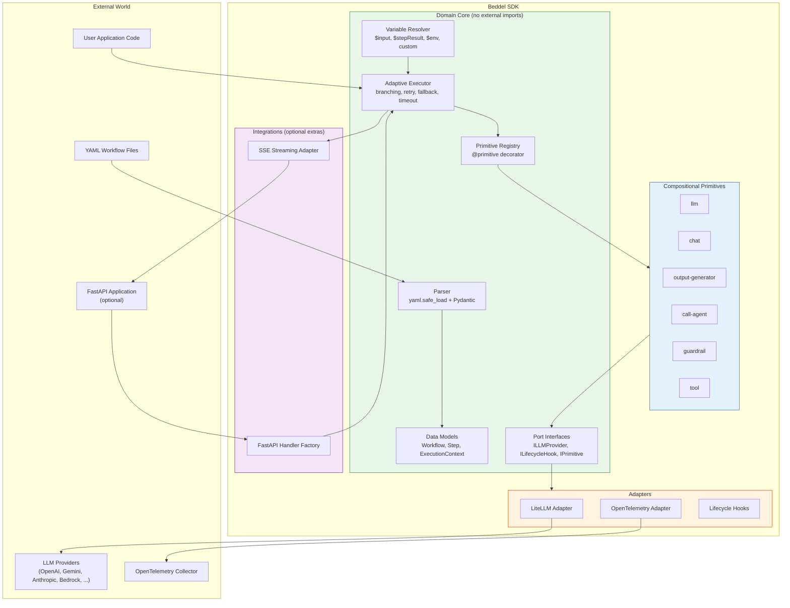

# 2. High Level Architecture

## 2.1 Technical Summary

Beddel uses Hexagonal Architecture (Ports & Adapters) to deliver a framework-agnostic Python SDK for declarative YAML-based AI workflows. The domain core — parser, resolver, executor, registry, and data models — is completely isolated from external dependencies through abstract port interfaces. Compositional primitives (llm, chat, output-generator, call-agent, guardrail, tool) execute within the domain boundary, accessing external services only through injected port implementations. Adapters (LiteLLM, OpenTelemetry, Lifecycle Hooks) implement port interfaces and are wired at the application boundary. This architecture directly supports the PRD goals of provider independence (NFR10), adaptive execution (FR3), and production-grade observability (FR16-FR19).

## 2.2 High Level Overview

1. **Architectural Style:** Hexagonal Architecture (Ports & Adapters) — a library/SDK, not a web application. The domain core defines abstract interfaces; adapters implement them for specific external services.
2. **Repository Structure:** Monorepo with `spec/` at root (shared cross-SDK fixtures) and `src/beddel-py/` for the Python SDK. Enables future multi-language SDKs sharing the same behavioral specification.
3. **Service Architecture:** Stateless SDK distributed via PyPI. No database, no server process. FastAPI integration is an optional extra (`pip install beddel[fastapi]`) for users who want HTTP endpoints.
4. **Primary Data Flow:** YAML workflow definition → Parser (validate) → Resolver (bind variables) → Executor (adaptive step execution) → Primitives (invoke via registry) → Adapters (external calls) → Results (structured output with events).
5. **Key Architectural Decisions:**
   - Domain core has zero external imports — all dependencies flow inward through ports (NFR10)
   - Streaming is an execution-level concern owned by the executor, not a response format adapter (lesson §13.6)
   - ExecutionContext metadata is the wiring mechanism for dependency injection into primitives (NFR18)
   - Factory functions provide sensible defaults for all required dependencies (lessons §13.2, §13.11)

## 2.3 High Level Project Diagram

## 2.4 Architectural and Design Patterns

- **Hexagonal Architecture (Ports & Adapters):** The domain core defines abstract port interfaces (`ILLMProvider`, `ILifecycleHook`, `IPrimitive`). Adapters implement these interfaces for specific external services. The domain core has zero imports from adapters or integrations — all dependencies flow inward. — _Rationale:_ Enables provider independence (swap LiteLLM for direct SDK calls without touching domain code), testability (mock ports in unit tests), and future multi-SDK parity (same ports, different language implementations).

- **Decorator-Based Registry:** Primitives register via `@primitive("name")` decorator. The registry validates contracts at registration time and provides lookup by name at execution time. — _Rationale:_ Enables user extensibility (custom primitives use the same decorator), eliminates hardcoded primitive lists, and supports `register_builtins()` for sensible defaults (lesson §13.11).

- **Strategy Pattern (Execution Strategies):** Each step declares an execution strategy (`fail`, `skip`, `retry`, `fallback`, `delegate`). The executor applies the strategy at runtime, decoupling error handling policy from execution logic. — _Rationale:_ Graduated error handling (NFR16) without polluting primitive code with retry/fallback logic. Strategies are composable and configurable per step.

- **Factory Pattern (Handler/Engine Builders):** `create_beddel_handler()` and similar factories wire adapters to ports with sensible defaults. Missing dependencies are auto-created (e.g., `LiteLLMAdapter()` when no provider supplied). — _Rationale:_ Lessons §13.2 and §13.11 — factory functions must produce usable instances. Reduces boilerplate for common use cases while allowing explicit overrides.

- **Dependency Injection via ExecutionContext:** Primitives receive dependencies through `ExecutionContext.metadata` rather than constructor injection or global state. The executor injects providers, hooks, and registries into the context before step execution. — _Rationale:_ Keeps primitives stateless and testable. The wiring contract (NFR18) documents every metadata key, preventing the runtime surprises described in lesson §13.5.

- **Async-First (asyncio):** All public APIs are `async`. Primitives, adapters, and the executor use `async/await` throughout. Streaming uses `AsyncGenerator`. — _Rationale:_ LLM calls are I/O-bound; async maximizes throughput. Streaming requires async generators. Python 3.11+ provides mature async support (NFR12).

- **Spec-Driven Testing:** Shared YAML fixtures in `spec/` define valid/invalid workflows and expected results. Tests load fixtures and validate behavior against expected outputs. — _Rationale:_ Single source of truth for cross-SDK behavioral validation (NFR4). Enables future multi-language SDKs to share the same test suite.

---
