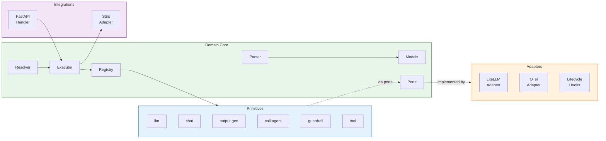
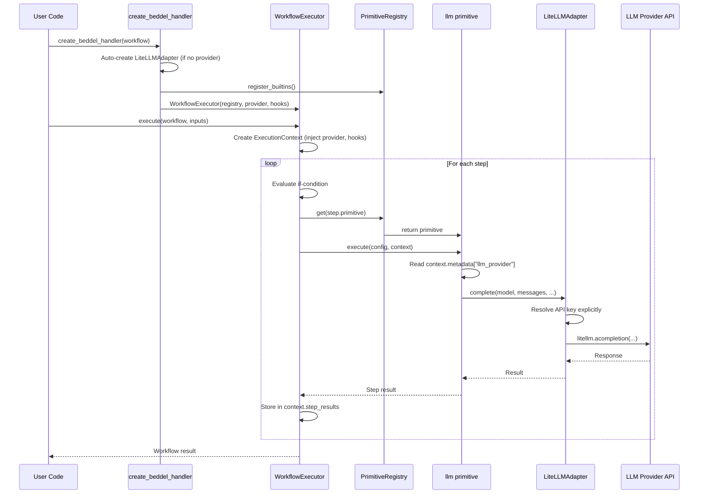

# 5. Components

## 5.1 Domain Core

**Responsibility:** Pure business logic with zero external dependencies. Defines the workflow execution model, data validation, variable resolution, and primitive contracts.

**Key Interfaces:**
- `WorkflowParser.parse(yaml_str) -> Workflow` — Validates and converts YAML to typed models
- `VariableResolver.resolve(template, context) -> Any` — Resolves `$input`, `$stepResult`, `$env`, and custom namespace references
- `WorkflowExecutor.execute(workflow, inputs) -> dict` — Runs a workflow to completion
- `WorkflowExecutor.execute_stream(workflow, inputs) -> AsyncGenerator[BeddelEvent, None]` — Streaming execution
- `PrimitiveRegistry.get(name) -> IPrimitive` — Looks up a registered primitive by name

**Dependencies:** None (domain core imports nothing from adapters or integrations).

**Technology Stack:** Python 3.11+, Pydantic 2.x, PyYAML 6.x (safe_load only), asyncio.

## 5.2 Compositional Primitives

**Responsibility:** Atomic building blocks that perform specific AI workflow operations. Each primitive implements the `IPrimitive` interface and is registered in the `PrimitiveRegistry`.

**Key Interfaces:**
- `IPrimitive.execute(config, context) -> Any` — Execute the primitive with given config and runtime context
- `@primitive("name")` — Decorator for registration

**Primitives:**

| Primitive | Purpose | Key Dependencies (via metadata) |
|-----------|---------|-------------------------------|
| `llm` | Single-turn LLM invocation | `llm_provider` |
| `chat` | Multi-turn conversation with history | `llm_provider` |
| `output-generator` | Template rendering via VariableResolver | None |
| `call-agent` | Nested workflow invocation | `workflow_loader`, `registry` |
| `guardrail` | Input/output validation | None |
| `tool` | External function invocation | `tool_registry` |

**Dependencies:** Domain core ports only (accessed via `ExecutionContext.metadata`).

## 5.3 Adapters

**Responsibility:** Implement port interfaces for specific external services. Adapters are the only layer that imports third-party libraries.

**Key Interfaces:**
- `LiteLLMAdapter` implements `ILLMProvider` — Multi-provider LLM calls via LiteLLM
- `OpenTelemetryAdapter` implements `ITracer` — Span generation and token tracking
- `LifecycleHookManager` implements `ILifecycleHook` — Event dispatch to registered handlers

**Dependencies:** LiteLLM, opentelemetry-api, httpx.

## 5.4 Integrations

**Responsibility:** Optional framework-specific wiring. Not part of the core SDK — installed via extras.

**Key Interfaces:**
- `create_beddel_handler(workflow, provider?, registry?, hooks?) -> FastAPI route` — Factory for HTTP endpoints
- `BeddelSSEAdapter.stream_events(events) -> AsyncGenerator[SSEEvent, None]` — W3C-compliant SSE serialization

**Dependencies:** FastAPI, sse-starlette (optional extras).

## 5.5 Component Diagrams

---
