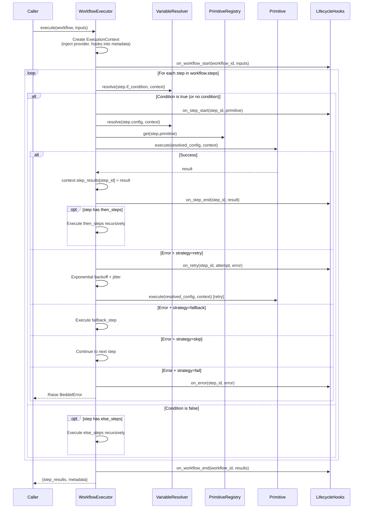
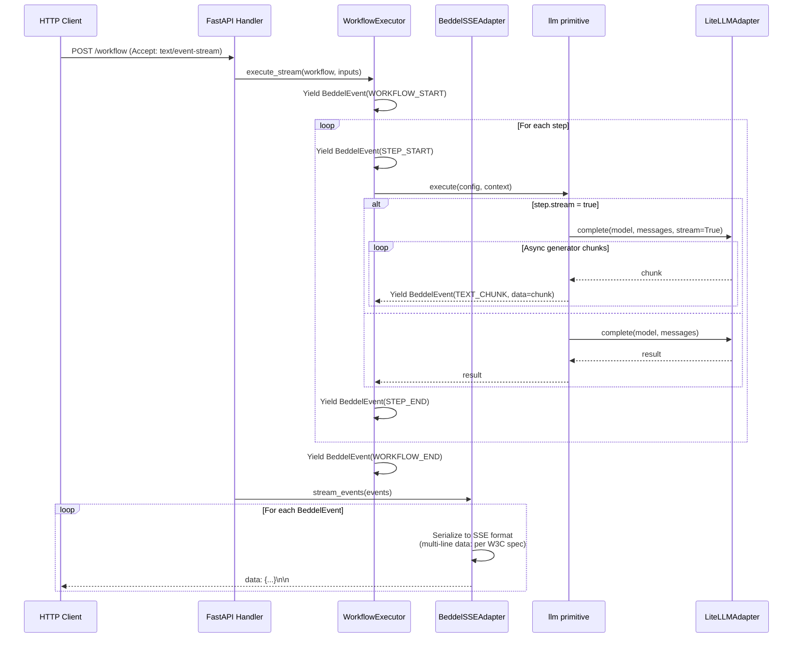

# 8. Core Workflows

## 8.1 Workflow Execution (Sequential with Branching)

```mermaid
sequenceDiagram
    participant Caller as Caller
    participant Exec as WorkflowExecutor
    participant Resolver as VariableResolver
    participant Registry as PrimitiveRegistry
    participant Prim as Primitive
    participant Hooks as LifecycleHooks

    Caller->>Exec: execute(workflow, inputs)
    Exec->>Exec: Create ExecutionContext<br/>(inject provider, hooks into metadata)
    Exec->>Hooks: on_workflow_start(workflow_id, inputs)

    loop For each step in workflow.steps
        Exec->>Resolver: resolve(step.if_condition, context)
        alt Condition is true (or no condition)
            Exec->>Hooks: on_step_start(step_id, primitive)
            Exec->>Resolver: resolve(step.config, context)
            Exec->>Registry: get(step.primitive)
            Exec->>Prim: execute(resolved_config, context)

            alt Success
                Prim-->>Exec: result
                Exec->>Exec: context.step_results[step_id] = result
                Exec->>Hooks: on_step_end(step_id, result)

                opt step has then_steps
                    Exec->>Exec: Execute then_steps recursively
                end

            else Error + strategy=retry
                Exec->>Hooks: on_retry(step_id, attempt, error)
                Exec->>Exec: Exponential backoff + jitter
                Exec->>Prim: execute(resolved_config, context) [retry]

            else Error + strategy=fallback
                Exec->>Exec: Execute fallback_step

            else Error + strategy=skip
                Exec->>Exec: Continue to next step

            else Error + strategy=fail
                Exec->>Hooks: on_error(step_id, error)
                Exec-->>Caller: Raise BeddelError
            end

        else Condition is false
            opt step has else_steps
                Exec->>Exec: Execute else_steps recursively
            end
        end
    end

    Exec->>Hooks: on_workflow_end(workflow_id, results)
    Exec-->>Caller: {step_results, metadata}
```

## 8.2 Streaming Execution (SSE)

```mermaid
sequenceDiagram
    participant Client as HTTP Client
    participant FAPI as FastAPI Handler
    participant Exec as WorkflowExecutor
    participant SSE as BeddelSSEAdapter
    participant Prim as llm primitive
    participant Adapter as LiteLLMAdapter

    Client->>FAPI: POST /workflow (Accept: text/event-stream)
    FAPI->>Exec: execute_stream(workflow, inputs)

    Exec->>Exec: Yield BeddelEvent(WORKFLOW_START)

    loop For each step
        Exec->>Exec: Yield BeddelEvent(STEP_START)
        Exec->>Prim: execute(config, context)

        alt step.stream = true
            Prim->>Adapter: complete(model, messages, stream=True)
            loop Async generator chunks
                Adapter-->>Prim: chunk
                Prim-->>Exec: Yield BeddelEvent(TEXT_CHUNK, data=chunk)
            end
        else
            Prim->>Adapter: complete(model, messages)
            Adapter-->>Prim: result
            Prim-->>Exec: result
        end

        Exec->>Exec: Yield BeddelEvent(STEP_END)
    end

    Exec->>Exec: Yield BeddelEvent(WORKFLOW_END)

    FAPI->>SSE: stream_events(events)
    loop For each BeddelEvent
        SSE->>SSE: Serialize to SSE format<br/>(multi-line data: per W3C spec)
        SSE-->>Client: data: {...}\n\n
    end
```

---
