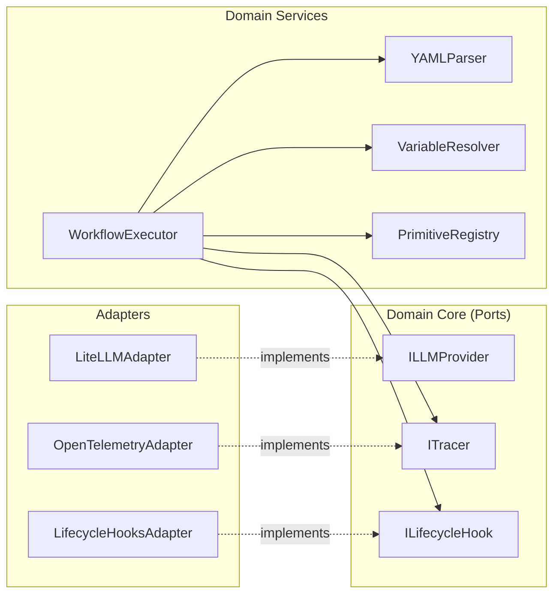

# Components

## Domain Core

### YAMLParser

**Responsibility:** Parse and validate YAML workflow definitions into Pydantic models.

**Key Interfaces:**
- `parse(yaml_content: str) -> WorkflowDefinition`
- `parse_file(path: Path) -> WorkflowDefinition`
- `validate(definition: WorkflowDefinition) -> list[str]`

**Dependencies:** Pydantic, PyYAML

**Technology Stack:** Pure Python with Pydantic validation

### VariableResolver

**Responsibility:** Resolve variable references (`$input.*`, `$stepResult.*`, `$env.*`) recursively.

**Key Interfaces:**
- `resolve(template: str, context: ExecutionContext) -> Any`
- `resolve_dict(data: dict, context: ExecutionContext) -> dict`

**Dependencies:** ExecutionContext

**Technology Stack:** Pure Python with regex-based pattern matching

### WorkflowExecutor

**Responsibility:** Orchestrate async sequential execution of workflow steps.

**Key Interfaces:**
- `execute(workflow: WorkflowDefinition, input: dict) -> ExecutionResult`
- `execute_step(step: StepDefinition, context: ExecutionContext) -> StepResult`

**Dependencies:** PrimitiveRegistry, VariableResolver, LifecycleHooks, TracingAdapter

**Technology Stack:** asyncio with early-return for streaming

### PrimitiveRegistry

**Responsibility:** Manage registration and lookup of workflow primitives.

**Key Interfaces:**
- `register(name: str) -> Callable[[PrimitiveFunc], PrimitiveFunc]` (decorator)
- `get(name: str) -> PrimitiveFunc`
- `list() -> list[str]`

**Dependencies:** None (standalone registry)

**Technology Stack:** Python decorator pattern with dict storage

## Primitives

### llm Primitive

**Responsibility:** Execute single-turn LLM calls with optional structured output.

**Key Interfaces:**
- `execute(config: LLMConfig, context: ExecutionContext) -> LLMResponse`

**Dependencies:** LiteLLMAdapter

**Technology Stack:** Async function registered via `@primitive.register("llm")`

### chat Primitive

**Responsibility:** Manage multi-turn conversational interactions.

**Key Interfaces:**
- `execute(config: ChatConfig, context: ExecutionContext) -> ChatResponse`

**Dependencies:** LiteLLMAdapter, message history management

**Technology Stack:** Async function with conversation state

### output-generator Primitive

**Responsibility:** Generate template-based outputs from step results.

**Key Interfaces:**
- `execute(config: OutputConfig, context: ExecutionContext) -> str`

**Dependencies:** VariableResolver

**Technology Stack:** Jinja2-style templating

### call-agent Primitive

**Responsibility:** Invoke nested workflows (agent composition).

**Key Interfaces:**
- `execute(config: CallAgentConfig, context: ExecutionContext) -> Any`

**Dependencies:** WorkflowExecutor (recursive)

**Technology Stack:** Async recursive execution

### guardrail Primitive

**Responsibility:** Validate inputs/outputs against Pydantic schemas.

**Key Interfaces:**
- `execute(config: GuardrailConfig, context: ExecutionContext) -> ValidationResult`

**Dependencies:** Pydantic

**Technology Stack:** Schema validation with detailed error reporting

### tool Primitive (P1)

**Responsibility:** Invoke registered Python functions as tools.

**Key Interfaces:**
- `execute(config: ToolConfig, context: ExecutionContext) -> Any`

**Dependencies:** Tool registry

**Technology Stack:** Dynamic function invocation

## Adapters

### LiteLLMAdapter

**Responsibility:** Translate Beddel requests to LiteLLM API calls.

**Key Interfaces:**
- `complete(request: LLMRequest) -> LLMResponse`
- `stream(request: LLMRequest) -> AsyncIterator[LLMChunk]`

**Dependencies:** litellm package

**Technology Stack:** Async wrapper around LiteLLM

### LifecycleHooksAdapter

**Responsibility:** Manage and dispatch lifecycle events.

**Key Interfaces:**
- `register(event: str, callback: Callable) -> None`
- `emit(event: str, data: dict) -> None`

**Dependencies:** None

**Technology Stack:** Event emitter pattern

### OpenTelemetryAdapter

**Responsibility:** Generate spans for workflow and step executions.

**Key Interfaces:**
- `start_workflow_span(workflow: WorkflowDefinition) -> Span`
- `start_step_span(step: StepDefinition, parent: Span) -> Span`

**Dependencies:** opentelemetry-api, opentelemetry-sdk

**Technology Stack:** OTLP-compatible tracing

> **Note:** The "Application Layer" (FastAPI, SSE) shown in diagrams is optional and requires the `beddel[fastapi]` extra.

## Component Diagram

