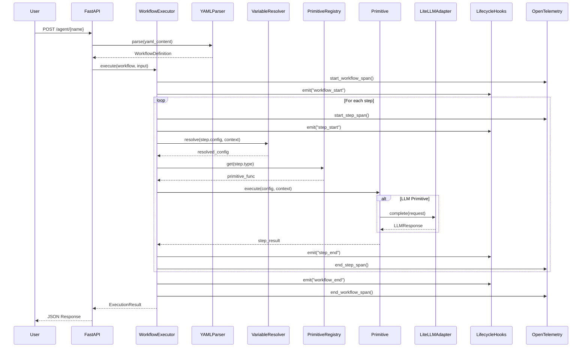
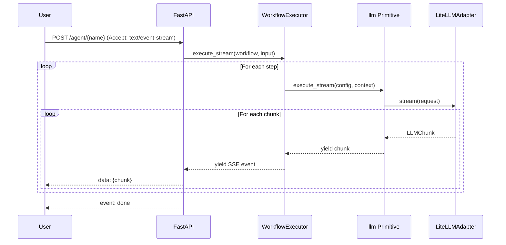

# Core Workflows

> **Note:** Diagrams show FastAPI as an example integration. The core SDK can be used standalone or with any framework via optional extras.

## Workflow Execution Sequence

## SSE Streaming Sequence

