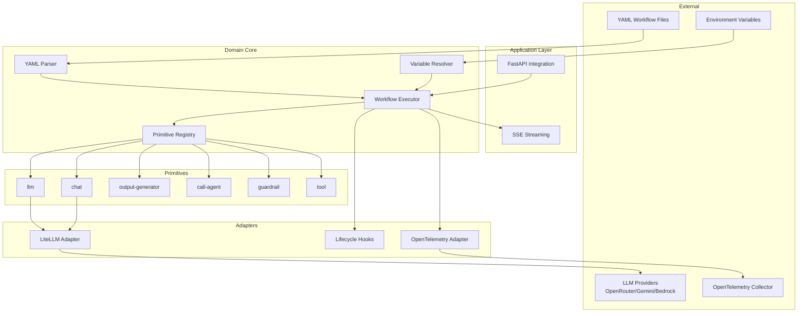

# High Level Architecture

## Technical Summary

Beddel Python implements a **Hexagonal Architecture** (Ports & Adapters) pattern to create a declarative YAML-based workflow engine for AI agents. The system parses YAML workflow definitions, resolves variables dynamically, and executes steps asynchronously through a registry of primitives. LiteLLM serves as the unified LLM provider abstraction, enabling support for 100+ providers without code changes. The architecture prioritizes extensibility, testability, and clean separation between domain logic and external integrations.

## High Level Overview

1. **Architectural Style:** Hexagonal Architecture (Ports & Adapters)
   - Domain core is isolated from external concerns
   - Ports define interfaces for external interactions
   - Adapters implement ports for specific technologies

2. **Repository Structure:** Monorepo (`botanarede/beddel`) com SDKs em `src/`
   - Shares `spec/` directory with all SDK implementations
   - Uses shared YAML fixtures for cross-SDK validation
   - See [Repository Strategy](./repository-strategy.md) for details

3. **Service Architecture:** Library/SDK (not a standalone service)
   - Consumed as a Python package via pip
   - Core is framework-agnostic; integrations available as optional extras
   - Example: `pip install beddel[fastapi]` for FastAPI integration

4. **Primary Data Flow:**
   ```
   YAML Definition → Parser → Workflow Model → Executor → Primitives → LLM/Tools → Output
   ```

5. **Key Architectural Decisions:**
   - **LiteLLM for providers:** Single abstraction for 100+ LLM providers
   - **Pydantic for validation:** Schema enforcement at parse-time and runtime
   - **Async-first:** All I/O operations use `async/await`
   - **Registry pattern:** Extensible primitive registration via decorators

## High Level Project Diagram



## Architectural and Design Patterns

- **Hexagonal Architecture (Ports & Adapters):** Isolates domain logic from infrastructure concerns, enabling easy testing and provider swapping. _Rationale:_ Aligns with PRD requirement for multi-provider support and testability.

- **Registry Pattern:** Primitives register themselves via decorators, enabling runtime extensibility. _Rationale:_ Supports FR4 requirement for extensible `PrimitiveRegistry`.

- **Strategy Pattern:** LLM providers implement a common interface, selected at runtime based on configuration. _Rationale:_ Enables seamless provider switching per FR11-FR13.

- **Observer Pattern:** Lifecycle hooks notify subscribers of workflow events. _Rationale:_ Supports FR15-FR17 for granular observability.

- **Factory Pattern:** `createBeddelHandler` creates configured FastAPI route handlers (via `beddel[fastapi]` extra). _Rationale:_ Simplifies integration per FR19.
