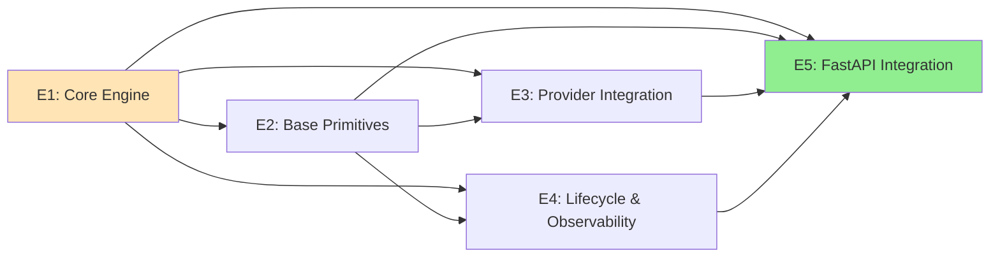

# Epic List

## MVP Epics (5 total, 4-6 weeks)

| Epic | Name | Stories | Dependencies | Key FRs |
|------|------|---------|--------------|---------|
| E1 | Core Engine | 4 | None | FR1-FR4 |
| E2 | Base Primitives | 7 | E1 | FR5-FR10 |
| E3 | Provider Integration | 3 | E1, E2 | FR11-FR14 |
| E4 | Lifecycle & Observability | 2 | E1, E2 | FR15-FR18 |
| E5 | FastAPI Integration (Optional Extra) | 3 | E1-E4 | FR19 |

## Epic Dependency Graph

## Epic Summaries

### E1: Core Engine
**Goal:** Foundation for YAML parsing, variable resolution, and workflow execution.

| Story | Description | Priority |
|-------|-------------|----------|
| E1.1 | YAML Parser with Pydantic validation | P0 |
| E1.2 | Variable Resolver (`$input`, `$stepResult`, `$env`) | P0 |
| E1.3 | Async Workflow Executor (sequential steps) | P0 |
| E1.4 | Primitive Registry with decorator pattern | P0 |

---

### E2: Base Primitives
**Goal:** Implement the 6 core primitives required for basic workflows.

| Story | Description | Priority |
|-------|-------------|----------|
| E2.1 | `llm` primitive (single-turn, blocking) | P0 |
| E2.2 | `llm` primitive (streaming mode) | P0 |
| E2.3 | `chat` primitive (multi-turn) | P0 |
| E2.4 | `output-generator` primitive | P0 |
| E2.5 | `call-agent` primitive (nested workflows) | P0 |
| E2.6 | `guardrail` primitive (input/output validation with Pydantic) | P0 |
| E2.7 | `tool` primitive (function invocation, basic) | P1 |

---

### E3: Provider Integration
**Goal:** LiteLLM integration with structured outputs for OpenRouter, Google, Bedrock.

| Story | Description | Priority |
|-------|-------------|----------|
| E3.1 | LiteLLM adapter (unified provider interface) | P0 |
| E3.2 | Structured output enforcement (Pydantic) | P0 |
| E3.3 | Provider-specific configuration (OpenRouter, Gemini, Bedrock) | P0 |

---

### E4: Lifecycle & Observability
**Goal:** Lifecycle hooks and OpenTelemetry tracing.

| Story | Description | Priority |
|-------|-------------|----------|
| E4.1 | Granular lifecycle hooks (`on_step_start`, `on_step_end`, etc.) | P0 |
| E4.2 | OpenTelemetry span generation | P0 |

---

### E5: FastAPI Integration
**Goal:** SSE streaming and handler creation for web applications.

| Story | Description | Priority |
|-------|-------------|----------|
| E5.1 | `createBeddelHandler` FastAPI factory | P0 |
| E5.2 | SSE streaming response adapter | P0 |
| E5.3 | Example application and documentation | P0 |

---

## Post-MVP Epics (Phase 2+)

| Epic | Name | Description |
|------|------|-------------|
| E6 | Advanced Tool Primitive | Full MCP integration, external tool servers |
| E7 | Memory & State | Session persistence, checkpoints |
| E8 | Agent-Native P1 | Tier selection, approval mechanism |
| E9 | Agent-Native P2 | Reflection loops, skill composition |
| E10 | DevOps & CI/CD | Pipeline setup, automated testing, deployment |
| E11 | Integration Primitives | Notion, Google Business, and other service-specific primitives |
| E12 | TypeScript SDK | AI-assisted translation from Python to TypeScript |
